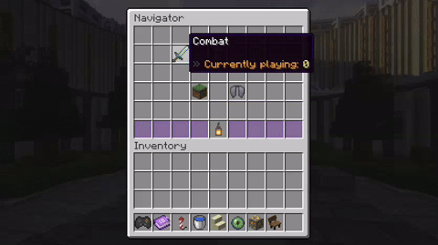
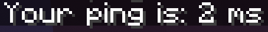

import '../index.css';
import Steve from '../../public/steve.webm';

import { LinkCard, CardGrid } from '@astrojs/starlight/components';
import Card from '../../components/Card.astro';

<CardGrid stagger>
	<Card title="30+ Minigames" icon="puzzle">
    
    Experience Our 30+ custom minigames, Skywars, Bedwars, UHC all the favourites right here in Australia.
  </Card>
	<Card title="Custom Survival" icon="sun">
    
    Experience our Custom Survival world with server mods created by our community. Collect all the plushies, build tables and chairs and much much more. All without downloading any mods.
  </Card>
	<Card title="Right Here in Brisbane" icon="seti:xml">
    
    *Captured on external Device in Brisbane*

    Experience as little latency possible and the Minigames and Survival experience you have come to expect from larger servers.
  </Card>
  <Card title="In Person Events" icon="star">
    <video autoplay loop muted src={Steve} />
    We run in person events in the club such as watching "A Minecraft Movie". We are always planning upcoming events and you can find out what is next on our socials.
  </Card>
  <Card title="Study Hangout" icon="open-book">
    We have a club table reserved in the libarary for study every tuesday!
  </Card>
</CardGrid>

## Socials
<CardGrid>
	<LinkCard title="Discord" icon="discord" href="https://qutmc.club/discord"/>
	<LinkCard title="Facebook" icon="facebook" href="https://qutmc.club/facebook"/>
	<LinkCard title="Instagram" href="https://qutmc.club/instagram"/>
  <LinkCard title="Twitch" icon="setting" href="https://qutmc.club/twitch"/>
</CardGrid>

## Development
<CardGrid>
  <LinkCard title="Modrinth" icon="setting" href="https://qutmc.club/modrinth"/>
  <LinkCard title="Github" icon="setting" href="https://qutmc.club/github"/>
</CardGrid>