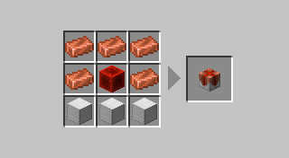

import { LinkCard, Card, CardGrid, Aside, Badge } from '@astrojs/starlight/components';

<Aside type="caution">
Before Creating a claim please read the [claim rules](../rules)
</Aside>
<Aside type="tip">
Using `/polydex` or using the PolyBook provides recipes ingame see [Polydex](../../polydex) for more info
</Aside>

Augments are a block that can be placed next to a claim anchor to grant extra effects and protections. See below an example of how they are placed:

## Augment Recipes and Effects

<CardGrid>
    <Card title="Ender Binding">
    
    Prevents any Endermen from teleporting while in a claim.
    </Card>
    <Card title="Lake Spirits Grace">
    
    Grants all players within a claim water breathing and Dolphin's Grace.
    </Card>
    <Card title="Angelic Aura">
    
    Grants all players within a claim regeneration.
    </Card>
    <Card title="Heavens Wings">
    
    <Aside type="note">
    Not obtainable, may have a way in the future.
    </Aside>
    Allows players to have creative fly in the claim.
    </Card>
    <Card title="Village Core">
    
    <Aside type="caution">
    Prevents Zombie Conversion, May break trade hall designs.
    </Aside>
    Protects all Villagers within a claim from damage caused by hostile mobs. 
    </Card>
    <Card title="Withering Seal">
    
    Prevents players from getting the wither status effect.
    </Card>
    <Card title="Chaos Zone">
    
    Grants strength to all players within the claim.
    </Card>
    <Card title="Greeter">
    
    Sends a message when a player enters your claim, Supports simplified text formatting.
    
    </Card>
    <Card title="PvP Area">
    
    Allows toggling PvP within a claim. Especially useful in subclaims if you want to have an arena or something within ur exising claim.
    </Card>
    <Card title="Explosion Controller">
    
    I dont know how this thing even works tbh - ZekeZ. Basically allows tnt dupers to work and stuff in claims but its very confusing. **Does not protect from creepers or explosions lit by owner/trusted.**
    </Card>
    <Card title="Force Field">
    
    <Aside type="caution">
    Also known for being the bane of elytra flight, If abused your force field may be removed by an admin (without refund).
    </Aside>
    blocks players from entering your claim. For weirdos who play singleplayer on a multiplayer server.
    </Card>
</CardGrid>