import { LinkCard, Card, CardGrid, Aside, Tabs, TabItem } from '@astrojs/starlight/components';

<Aside type="caution">
Before Creating a claim please read the [claim rules](../rules)
</Aside>
<Aside type="tip">
Using `/polydex` or using the PolyBook provides recipes ingame see [Polydex](../../polydex) for more info
</Aside>

## Your First Claim

Your first goal in creating a claim is finding an enderpearl once you have found one you can start the recipe:

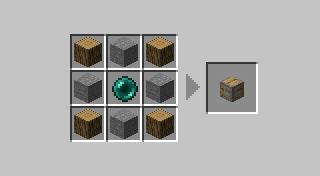

this will make your first claim, a small claim with a 2 radius (5x5x5 Blocks)

now its going to be hard to build in without seeing it so you will want to...
## View Claim Borders

to view the claim border you will need to create Goggles of Claim Revealing:

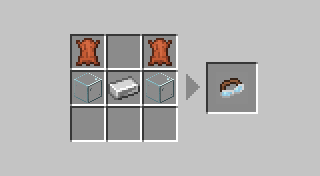

once equiped in hand,head or in the trinkets slot you will be able to view Claims

*trinkets slot currently unavailable*

## Claim Anchor Upgrades

There is two versions of Claim Upgrades, Upgraded Anchors and Upgrade Kits.

Upgraded Anchors use your existing anchor in the recipe requiring you to remove its placement. Upgrade kits you right click the placed anchor with to upgrade. The costs are exactly the same currently.
<Tabs>
  <TabItem label="Anchor Upgrades">
    <CardGrid>
        <Card title="Primitive - 4 radius">
        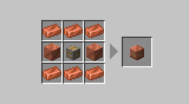
        </Card>
        <Card title="Reinforced - 8 radius">
        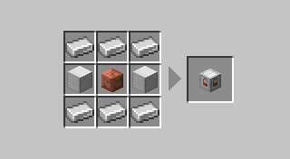
        </Card>
        <Card title="Glistening - 16 radius">
        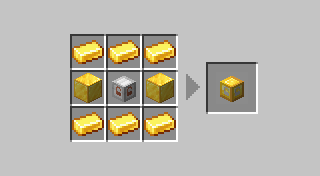
        </Card>
        <Card title="Emeradic - 32 radius">
        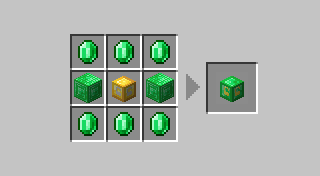
        </Card>
        <Card title="Crystal - 64 radius">
        
        </Card>
        <Card title="Nethered - 128 radius">
        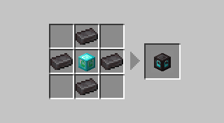
        </Card>
    </CardGrid>
  </TabItem>
  <TabItem label="Upgrade Kits">
      <CardGrid>
        <Card title="Primitive - 4 radius">
        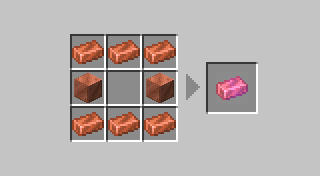
        </Card>
        <Card title="Reinforced - 8 radius">
        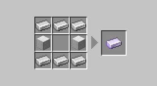
        </Card>
        <Card title="Glistening - 16 radius">
        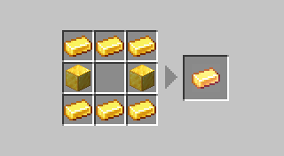
        </Card>
        <Card title="Emeradic - 32 radius">
        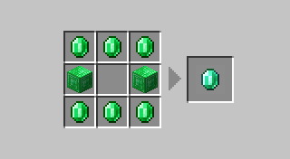
        </Card>
        <Card title="Crystal - 64 radius">
        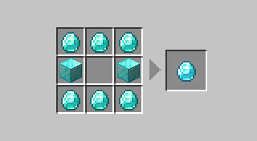
        </Card>
        <Card title="Nethered - 128 radius">
        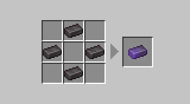
        </Card>
    </CardGrid>
  </TabItem>
</Tabs>

